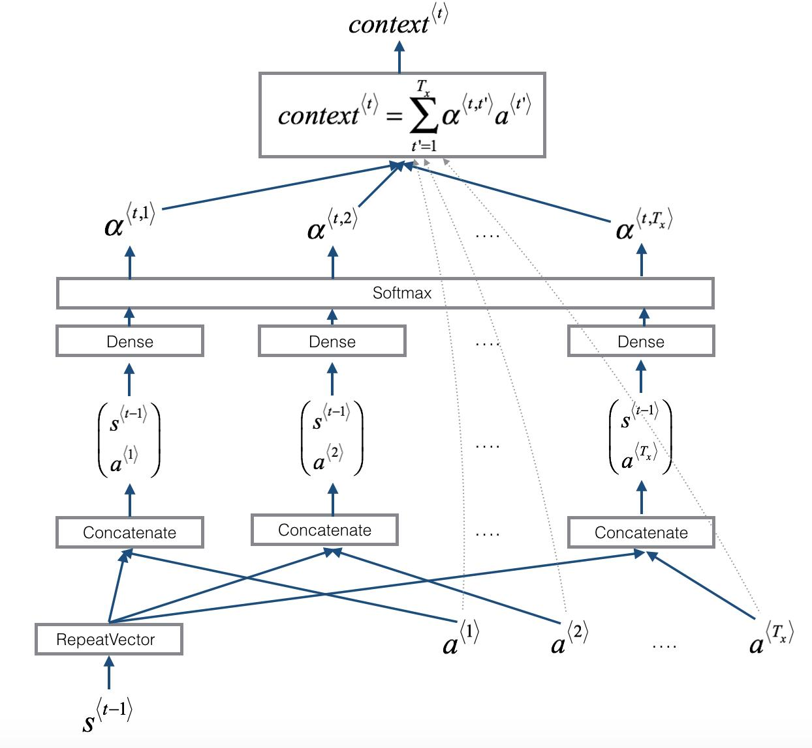

<br>

# Attention Models

<br>

<p align = "justify">
Attention models, also called attention mechanisms, are deep learning techniques used to provide an additional focus on a specific component. In deep learning, attention relates to focus on something in particular and note its specific importance. The model typically focuses on one component within the network's architecture that's responsible for managing and quantifying the interdependent relationships within input elements, called self-attention, or between input and output elements, called general attention.</p>

<p align = "justify">
Instead of focusing on the entire input sequence, it focuses on a few components and pays attention to them based on their attention score, while ultimately filters the activation of each of those components. The aim of attention models is to reduce larger, more complicated tasks into smaller, more manageable areas of attention to understand and process sequentially. Using attention models enables the network to focus on a few particular aspects at a time and ignoring the rest. This allows for efficient and sequential data processing, especially when the network needs to categorize entire datasets.</p>

<br>
<div align = center></div>
<br>

<div align = center><a href = "https://www.programmersought.com/article/80142945926/">Neural machine translation by jointly learning to align and translate paper reading - Programmer Sought</a></div>
<br>


## Types of Attention Models:

<br>

- **Global Attention Model -**

<p align = "justify">
The global attention model, which is also similar to the soft attention model, collects inputs from all encoder and decoder states before evaluating the current state to determine the output. This model uses each encoder step and each decoder preview step to calculate the attention weights or align weights. It also multiplies each encoder step by global align weights to determine the context value to feed to the recurrent neural networks (RNN) cell. This allows the model to find the decoder output.</p>

<br>
<div align = center></div>
<br>

As seen from the figure, $a_t$ align weights or attention weights are calculated using each encoder step and *$h_t$* decoder previous step. Then using $a_t$ context vector is calculated by taking the product of *Global align weights* and *each encoder steps*. It is then fed to RNN cell to find decoder output.

<br>

- **Local Attention Model -**


<p align = "justify">
The local attention model is similar to the global attention model, but it only uses a few encoder positions to determine the align weights. The model calculates the align weights and context vector by using the first single-aligned position and a selection of words from the encoder source. The local attention model also allows for monotonic alignment and predictive alignment. Monotonic alignment assumes only select information matters, whereas predictive alignment allows the model itself to predict the final alignment position.</p>
<p align = "justify">
The local attention model is similar to the hard attention model. However, unlike the local attention model, the hard attention model isn't differential at most points. Conversely, the local attention model combines aspects of hard and soft attention.</p>

<br>
<div align = center></div>
<br>

As seen from the figure, the first single-aligned position $p_t$is found then a window of words from source (encoder) layer along with $h_t$is used to calculate aligned weights and context vector.

<br>

- ****Self Attention Model -****

<p align = "justify">
The self-attention model focuses on different positions from the same input sequence. It may be possible to use the global attention and local attention model frameworks to create this model. However, the self-attention model includes the same input sequence in place of the target output sequence.</p>

<br>

### Attention Mechanism:

<br>

Bahdanau et al.'s *attention mechanism* is divided into the step-by-step computations of the *alignment scores,* the *weights* and the *context vector*:

- **Alignment Score** - The alignment model takes the encoded hidden states, $h_i$, and the previous decoder output, $s_t{}_-{}_1$, to compute a score, $e_t{}_,{}_i$, that indicates how well the elements of the input sequence align with the current output at position, $t$. The alignment model is represented by a function, $a(.)$, which can be implemented by a feedforward neural network:

$$
e_t{}_,{}_i = a(s_t{}_-{}_1 , h_i)
$$

- **Weights** - The weights, $α_t{}_,{}_i$ , are computed by applying a softmax operation to the previously computed alignment scores:

$$
α_t{}_,{}_i = softmax(e_t{}_,{}_i)
$$

- **Context Vector**  -  A unique context vector, $c_t$, is fed into the decoder at each time step. It is computed by a weighted sum of all, $T$, encoder hidden states:

$$
c_t = ∑_{i=1}^T \alpha_{t,i} h_i
$$

<br>

The general attention mechanism makes use of three main components, namely the *queries*, $Q$, the *keys*, $K$, and the *values*, $V$,

- Each query vector, $q = s_{t-1}$ is matched against a database of keys to compute a score value. This matching operation is computed as the dot product of the specific query under consideration with each key vector, $k_i$:

$$
e_{q,k_i} = q . k_i
$$

- The scores are passed through a softmax operation to generate the weights:

$$
\alpha_{q,k_i} = softmax(e_{q,k_i})
$$

- 1. The generalized attention is then computed by a weighted sum of the value vectors, $v_{k_i}$, where each value vector is paired with a corresponding key

$$
attention(q, K, V) = ∑_i \alpha_{q,k_i}v_{k_i}
$$

<br>

### Attention based Sequence Handling:

<br>
<p align = "justify">
Attention mechanism comprises of stacks of encoders and decoders. The encoder processes each item in the input sequence, it compiles the information into a vector called context. Encoders typically handles two inputs at each time step: an input (one word from the input sequence as word embeddings) and a hidden state.</p>
<p align = "justify">
The encoder then sends the context over the decoder, which then begins producing the output sequence item by item.</p>
<br>

**Word Embedding:**

<br>
<p align = "justify">
Word embeddings are a class of methods, that turn words into a vector space that captures meaning/semantic information of the words. Ex:- king - man + woman = queen.</p>

<br>
<div align = center></div>

<br>
<p align = "justify">
After processing the entire input sequence, the encoder sends the context over to the decoder, which begins producing the output sequence item by item. The context is a vector of floats. Generally, it is the last hidden state of the encoder.</p>

<br>
<div align = center></div>
<br>

**Attention Mechanism:**

<br>
<p align = justify>
In attention models, the encoder passes a lot more data to the decoder. Instead of just the last hidden state of the encoding state, all the hidden states are passed to the decoder.</p>

<br>
<div align = center></div>
<br>

<p align = justify>
In order to associate a sense of attention or focus on the parts of input relevant to this decoding time step,</p>

<div align = justify>
    <ul>
        <li>Each encoder hidden state is associated with a certain word in the input sentence.</li>
        <li>A score is assigned to each hidden state.</li>
        <li>Each hidden state is multiplied by its $softmax$ score, thus amplifying hidden states with high scores and drowning out hidden states with low scores.</li>
    </ul>
</div>

<br>
<div align = center></div>
<br>

<p align = justify>
In the attention process, at its attention step, we use the encoder hidden states and context vectors at each time step and concatenate them into one vector, before passing the vector through a feedforward neural network. Finally, the output of the feedforward neural network indicates the output of this time step.</p>

<br>
<div align = center></div>
<br>

### **Code Snippet for Attention Mechanism:**

<br>

```python
from numpy import array
from numpy import random
from numpy import dot
from scipy.special import softmax
 
# Encoder representations of four different words
word_1 = array([1, 0, 0])
word_2 = array([0, 1, 0])
word_3 = array([1, 1, 0])
word_4 = array([0, 0, 1])
 
# Stacking the word embeddings into a single array
words = array([word_1, word_2, word_3, word_4])
 
# Generating the weight matrices
random.seed(42)
W_Q = random.randint(3, size=(3, 3))
W_K = random.randint(3, size=(3, 3))
W_V = random.randint(3, size=(3, 3))
 
# Generating the queries, keys and values
Q = words @ W_Q
K = words @ W_K
V = words @ W_V
 
# Scoring the query vectors against all key vectors
scores = Q @ K.transpose()
 
# Computing the weights by a softmax operation
weights = softmax(scores / K.shape[1] ** 0.5, axis=1)
 
# Computing the attention by a weighted sum of the value vectors
attention = weights @ V
```

<br>

### Code Snippet for Attention Architecture:

<br>

```python
model = Sequential()
model.add(Embedding(10000, 100, input_length=200))
model.add(Bidirectional(LSTM()units=16, return_sequences=True, dropout=0.5, recurrent_dropout=0.7))
model.add(SeqSelfAttention(attention_activation='sigmoid'))
model.add(Flatten())
model.add(Dense(1, activation='sigmoid'))
model.summary()
```

<br>

---

<br>


<br> 

**Project Name**

Automated Text-Translation and Data Visualization using Generative Adversarial Networks (GANs)

@eYSIP-2022

<br>

**Links**

Cover Photo ~ [Photo by Oliver Pecker on Unsplash](https://unsplash.com/photos/HONJP8DyiSM?utm_source=unsplash&utm_medium=referral&utm_content=creditShareLink)

Logo ~ [WEB Free Fonts for Windows and Mac / Font free Download - OnlineWebFonts.COM](http://www.onlinewebfonts.com)

Icon licensed by CC 3.0

<br>

**Notes**

CNN: [Convolutional Neural Networks (CNNs)](https://samya-ravenxi.notion.site/Convolutional-Neural-Networks-CNNs-cb2ca9e7765b46f4a6437af0540f7abd)

RNN: [Recurrent Neural Networks (RNNs)](https://samya-ravenxi.notion.site/Recurrent-Neural-Networks-RNNs-e904a4e282bf4141865204a47e01521f)

LSTM: [Long Short-Term Memory Networks (LSTMs)](https://samya-ravenxi.notion.site/Long-Short-Term-Memory-Networks-LSTMs-5f1ffa44545641dfbe4c7e54ca85c6b4)

Attention: [Attention Models](https://samya-ravenxi.notion.site/Attention-Models-6f1b3e2c50fe4ab38264db9b01f6c578)

Transformer: [Transformers](https://samya-ravenxi.notion.site/Transformers-b31498d91b7c4198a29aaae5059e674f)

GAN: [Generative Adversarial Networks (GANs)](https://samya-ravenxi.notion.site/Generative-Adversarial-Networks-GANs-5a6b5dae6268418f988762f23c4996b3)

<br>

**References**

[Visualizing A Neural Machine Translation Model (Mechanics of Seq2seq Models With Attention)](https://jalammar.github.io/visualizing-neural-machine-translation-mechanics-of-seq2seq-models-with-attention/)

[Attention Networks](https://towardsdatascience.com/attention-networks-c735befb5e9f)

[The Attention Mechanism from Scratch - Machine Learning Mastery](https://machinelearningmastery.com/the-attention-mechanism-from-scratch/)

[Understanding Attention Mechanism: Natural Language Processing](https://medium.com/analytics-vidhya/https-medium-com-understanding-attention-mechanism-natural-language-processing-9744ab6aed6a)

[Attention Mechanism In Deep Learning | Attention Model Keras](https://www.analyticsvidhya.com/blog/2019/11/comprehensive-guide-attention-mechanism-deep-learning/)