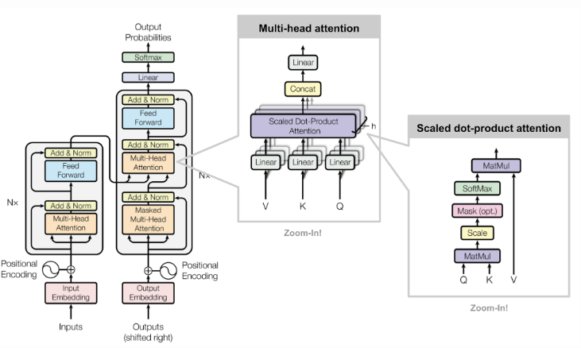

 

# Transformers

 

  

 

From a high level perspective, a transformer constitutes of a encoding component (stack of encoders) and  a decoding component (stack of decoders) of the same number.

 

  

 

Each of these encoders comprise of a self-attention layer and feed forward network. The decoder has both those layers, but between them is an attention layer that helps the decoder focus on relevant parts of the input sentence.

 

  

 

During the encoding, the word in each position flows through its own path in the encoder and there are dependencies between these paths in self-attention layer. The feed-forward layer does not have those dependencies and thus the various paths can be executed in parallel when flowing through it.

 

## Types of Attention Models:

 

- **Global Attention Model -**

The global attention model, which is also similar to the soft attention model, collects inputs from all encoder and decoder states before evaluating the current state to determine the output. This model uses each encoder step and each decoder preview step to calculate the attention weights or align weights. It also multiplies each encoder step by global align weights to determine the context value to feed to the recurrent neural networks (RNN) cell. This allows the model to find the decoder output.

 

 

As seen from the figure, $a_t$ align weights or attention weights are calculated using each encoder step and *$h_t$* decoder previous step. Then using $a_t$ context vector is calculated by taking the product of *Global align weights* and *each encoder steps*. It is then fed to RNN cell to find decoder output.

 

- **Local Attention Model -**

The local attention model is similar to the global attention model, but it only uses a few encoder positions to determine the align weights. The model calculates the align weights and context vector by using the first single-aligned position and a selection of words from the encoder source. The local attention model also allows for monotonic alignment and predictive alignment. Monotonic alignment assumes only select information matters, whereas predictive alignment allows the model itself to predict the final alignment position.

The local attention model is similar to the hard attention model. However, unlike the local attention model, the hard attention model isn't differential at most points. Conversely, the local attention model combines aspects of hard and soft attention.

 

 

As seen from the figure, the first single-aligned position $p_t$ is found then a window of words from source (encoder) layer along with $h_t$ is used to calculate aligned weights and context vector.

 

- ****Self Attention Model -****

The self-attention model focuses on different positions from the same input sequence. It may be possible to use the global attention and local attention model frameworks to create this model. However, the self-attention model includes the same input sequence in place of the target output sequence.

 

### Self-Attention Mechanism:

 

**Scaled Dot-Product Attention:**

The very first step of calculating the self-attention is to create three vectors from each of the encoder's input vectors, namely, Query vector Q, Key vector K and a Value vector V. These vectors are created by multiplying the embedding by three matrices that are used in the training process.

 

  

 

The second step is to calculate a score. Taking "Thinking" as an example to demonstrate this, the score is calculated by taking the dot product of the query vector and the key vector of the respective word.

So for self-attention of the word in the first position the first score would be $q_1$ and $k_1$ whereas, the second score would be the dot product of $q_1$ and $k_2$

And the next step is to divide the scores by the square root of the dimension of the key vectors to have more stable gradients. Then pass the results to a $softmax$ to normalize the scores so that they add up to 1.

 

  

 

Then the value vector is multiplied by the $softmax$ score and are added up. The intuition behind doing this is to focus on specific words and dillute the rest. Then this sum of weighted value vectors produces the output of the self-attention layer.

 

  

 

**Multi-head Attention:**

 

Multi-headed attention we have not only one, but multiple sets of Query/Key/Value weight matrices (the Transformer uses eight attention heads, so we end up with eight sets for each encoder/decoder). Each of these sets is randomly initialized. Then, after training, each set is used to project the input embeddings (or vectors from lower encoders/decoders) into a different representation subspace. After this, we end up with eight different Z matrices, but the feed-forward layer is not expecting that. So we finally condense these eight matrices down into a single matrix by multiplying them by an additional weight matrix. 

To summarize the above,

 

  

 

**Positional Encoding:**

 

The order of the sequence is represented using positional encoding too preserve the order of the words in the input sequence. To address this, the transformer adds a vector to each input embedding. These vectors follow a specific pattern that the model learns, which helps it determine the position of each word, or the distance between different words in the sequence. The intuition here is that adding these values to the embeddings provides meaningful distances between the embedding vectors once they're projected into Q/K/V vectors and during dot-product attention.

As an addition to the already proposed architecture, each encoder has a residual connection around it and is followed by a layer normalization step. And this follows in a similar fashion in the sub-layers of the decoder as well.

 

  

 

**Decoder's Perspective:**

 

The encoder start by processing the input sequence. The output of the top encoder is then transformed into a set of attention vectors K and V. These are to be used by each decoder in its "encoder-decoder attention" layer which helps the decoder focus on appropriate places in the input sequence. The following steps repeat the process until a special symbol is reached indicating the transformer decoder has completed its output. The output of each step is fed to the bottom decoder in the next time step, and the decoders bubble up their decoding results just like the encoders did. And just like we did with the encoder inputs, we embed and add positional encoding to those decoder inputs to indicate the position of each word.

In the decoder, the self-attention layer is only allowed to attend to earlier positions in the output sequence. This is done by masking future positions (setting them to `-inf`) before the $softmax$ step in the self-attention calculation.

The "Encoder-Decoder Attention" layer works just like multiheaded self-attention, except it creates its Queries matrix from the layer below it, and takes the Keys and Values matrix from the output of the encoder stack.

 

  

 

**The Final Layer and Softmax Layer:**

 

The Linear layer is a simple fully connected neural network that projects the vector produced by the stack of decoders, into a much, much larger vector called a logits vector. This is the non-normalized probability distribution over words that are likely to occur.

The softmax layer then turns those scores into probabilities (all positive, all add up to 1.0) i.e, it gives back normalized probability distribution over words that are likely to occur. The cell with the highest probability is chosen, and the word associated with it is produced as the output for this time step.

 

  

 

### **Code Snippet for Transformers:**

 

**TensorFlow:** [Transformer model for language understanding | Text | TensorFlow](https://www.tensorflow.org/text/tutorials/transformer)

**PyTorch:** [The Annotated Transformer](http://nlp.seas.harvard.edu/2018/04/03/attention.html)

 

---

 

  

**Project Name**

Automated Text-Translation and Data Visualization using Generative Adversarial Networks (GANs)

@eYSIP-2022

 

**Links**

Cover Photo ~ [Photo by Oliver Pecker on Unsplash](https://unsplash.com/photos/HONJP8DyiSM?utm_source=unsplash&utm_medium=referral&utm_content=creditShareLink)

Logo ~ [WEB Free Fonts for Windows and Mac / Font free Download - OnlineWebFonts.COM](http://www.onlinewebfonts.com)

Icon licensed by CC 3.0

 

**Notes**

CNN: [Convolutional Neural Networks (CNNs)](https://samya-ravenxi.notion.site/Convolutional-Neural-Networks-CNNs-cb2ca9e7765b46f4a6437af0540f7abd)

RNN: [Recurrent Neural Networks (RNNs)](https://samya-ravenxi.notion.site/Recurrent-Neural-Networks-RNNs-e904a4e282bf4141865204a47e01521f)

LSTM: [Long Short-Term Memory Networks (LSTMs)](https://samya-ravenxi.notion.site/Long-Short-Term-Memory-Networks-LSTMs-5f1ffa44545641dfbe4c7e54ca85c6b4)

Attention: [Attention Models](https://samya-ravenxi.notion.site/Attention-Models-6f1b3e2c50fe4ab38264db9b01f6c578)

Transformer: [Transformers](https://samya-ravenxi.notion.site/Transformers-b31498d91b7c4198a29aaae5059e674f)

GAN: [Generative Adversarial Networks (GANs)](https://samya-ravenxi.notion.site/Generative-Adversarial-Networks-GANs-5a6b5dae6268418f988762f23c4996b3)

 

**References**

[Attention Networks](https://towardsdatascience.com/attention-networks-c735befb5e9f)

[The Illustrated Transformer](https://jalammar.github.io/illustrated-transformer/)

[Attention Is All You Need](https://arxiv.org/abs/1706.03762)